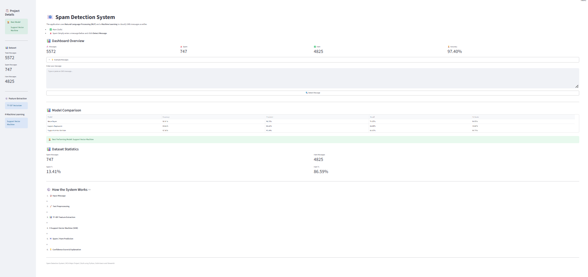

# SMS Spam Detection System using Machine Learning

A machine learning-based web application that classifies SMS messages as **Spam** or **Ham (Not Spam)**. The system uses Natural Language Processing (NLP) techniques, TF-IDF feature extraction, and multiple machine learning algorithms to accurately detect spam messages. The best-performing model is deployed using **Streamlit** to provide an interactive web interface.

----

## Project Overview

Spam SMS messages are widely used for phishing, fraud, and unwanted advertising. This project aims to automatically classify incoming SMS messages as **Spam** or **Ham** using machine learning.

The application performs:
- Text preprocessing
- Feature extraction using TF-IDF
- Model training and evaluation
- Automatic model selection
- Real-time prediction through a Streamlit web application

----

## Features

- SMS text preprocessing
- TF-IDF feature extraction
- Training multiple machine learning models
- Performance comparison using evaluation metrics
- Automatic selection of the best-performing model
- Interactive Streamlit web application
- Spam keyword highlighting and explanation
- Modular project structure

----

## Technologies Used

- Python
- Streamlit
- Scikit-learn
- Pandas
- NumPy
- NLTK
- Joblib
- Matplotlib

----

## Dataset

This project uses the **SMS Spam Collection Dataset**, a publicly available dataset containing **5,572 SMS messages** labeled as either **Spam** or **Ham (Not Spam)**.

### Dataset Statistics

- Total Messages: **5,572**
- Ham Messages: **4,825**
- Spam Messages: **747**

The dataset is stored in the `data/` directorty as:

```text
data/spam.csv
```

The dataset is used for preprocessing, feature extraction, model training, and evaluation.

----

## Project Structure

```text
SPAM DETECTION/
    data/
    models/
    notebooks/
    report_images/
    reports/
    screenshots/
    src/
    tests/
    app.py
    main.py
    requirements.txt
    README.md
    .gitignore
```

----

## Machine Learning Models

The following learning algorithms were implemented and evaluated:

- Naive Bayes
- Logistic Regression
- Support Vector Machine (SVM)

The SVM achieved the best overall performance and was selected for deployment.

----

## Model Performance

| Model | Accuracy | Precision | Recall | F1 Score |
|------|---------:|----------:|-------:|---------:|
| Naive Bayes | 96.41% | 98.25% | 74.67% | 84.85% |
| Logistic Regression | 93.81% | 96.55% | 56.00% | 70.89% |
| Support Vector Machine | **97.40%** | **95.49%** | **84.67%** | **89.75%** |

----

## Installation

Clone the repository

```bash
git clone https://github.com/Amnair0236/Spam-Detection.git
```

Move into the project folder

```bash
cd spam-detection
```

Install the required packages

```bash
pip install -r requirements.txt
```

Run the application

```bash
streamlit run app.py
```

## Application Screenshots

The screenshots below demonstrate the working of the application.

- Dashboard 
 

- Spam Prediction 


- Ham Prediction 


----

## Future Enhancements

- Deep Learning models (LSTM/BERT)
- Multi-language spam detection
- Email spam classification
- Real-time API integration
- Larger datasets for improved accuracy

----

## Author

**Athira Nair**

MCA Major Project

----
